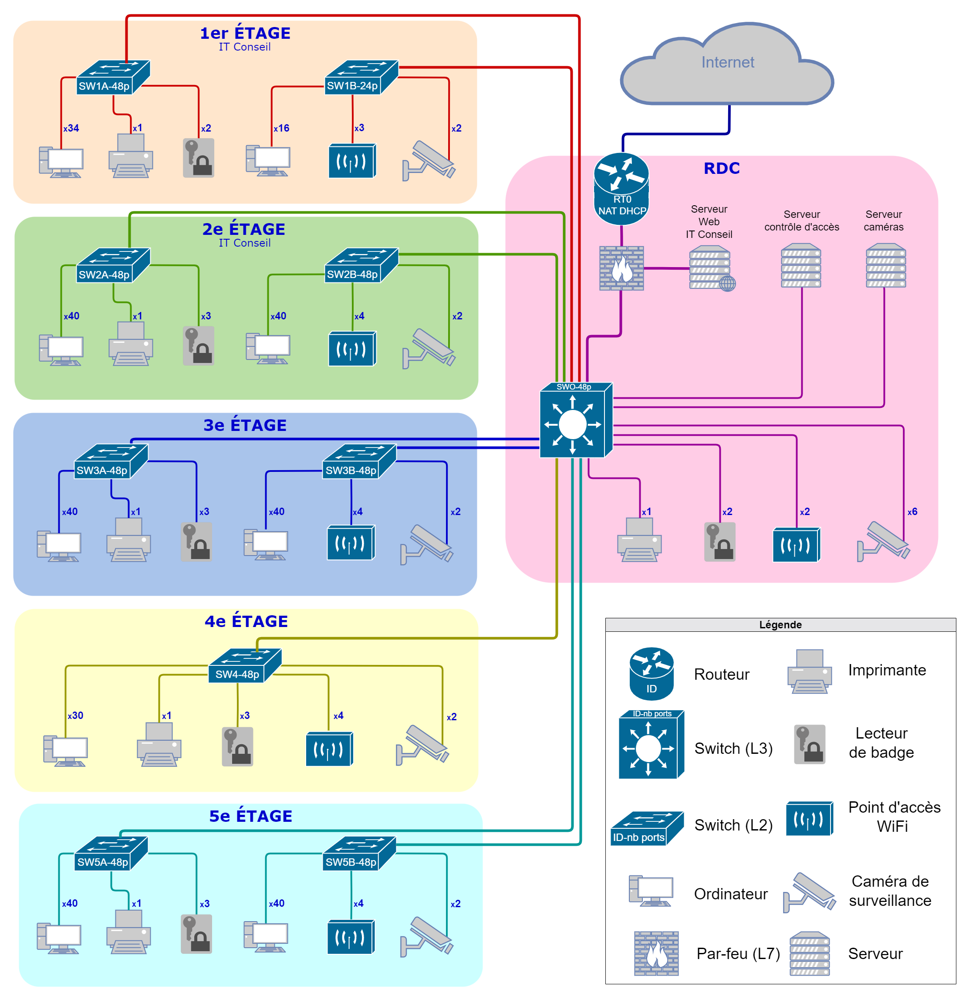
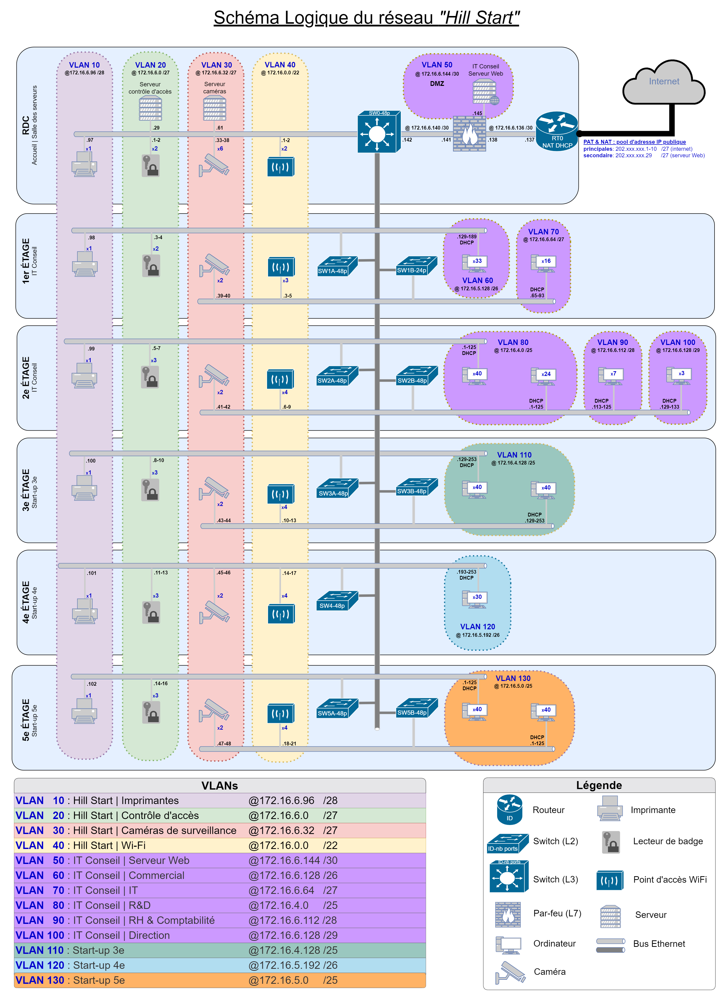
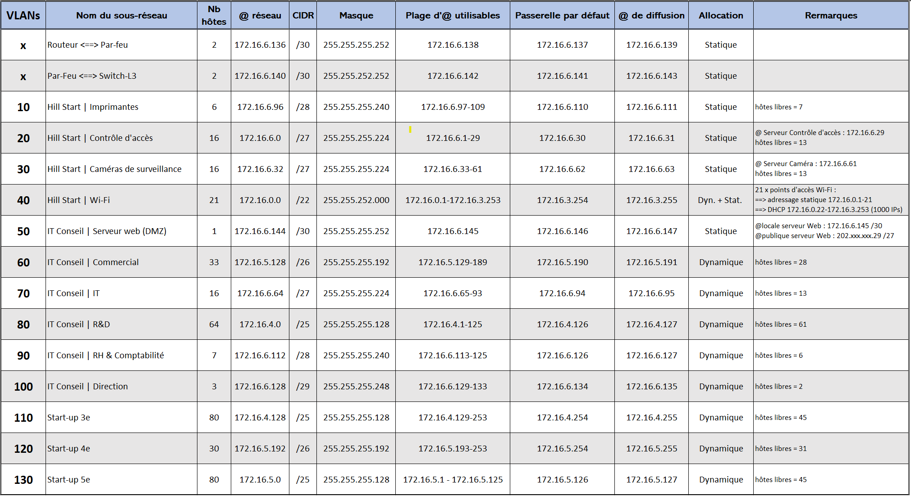

# PROJET 3 ***["Mettez en place et documentez le réseau local d'une startup"](https://openclassrooms.com/fr/paths/734/projects/1381/assignment)***

## I. Missions

Concevoir et implémenter l'infrastructure réseau du nouveau bâtiment de l'entreprise Hill Start, comprenant :

### 1. Schéma physique du réseau

Positionnement des équipements selon les plans du bâtiment.
Capacité de chaque switch, en lien avec le cahier des charges.

### 2. Schéma logique du réseau

Création et configuration des VLAN (noms, adresses réseaux, masques).
Règles de connexion entre les VLAN.

### 3. Plan d'adressage réseau  

Allocation des adresses IP (DHCP et statiques).
Définition des adresses de broadcast et des masques de sous-réseau.

## II. Réalisation

Dans un premier temps, j'ai pris en compte les besoins spécifiques et les spécifications du cahier des charges selon les plans du bâtiment. J'ai élaboré le schéma physique en tenant compte du dimensionnement des switches et en détaillant l'emplacement de chaque équipement dans leur local respectif. Parallèlement, j'ai avancé sur le schéma logique et le plan d'adressage du réseau en définissant les VLANs, leurs adresses réseau avec des masques adaptés. Mon plan d'adressage réseau comprend les configurations DHCP et statiques, avec pour chaque VLAN des masques adaptés aux besoins du cahier des charges. J'ai également rédigé une matrice avec les règles de connexion inter-VLAN.

### 1. Schéma physique

  

### 2. Schéma logique

  

### 3. Plan d'adressage

  

## III. Compétences et technologies acquises

- Concevoir la cartographie d'un réseau via [draw.io](https://app.diagrams.net/)
- Construire un réseau TCP-IP
- Formaliser les procédures via une documentation technique

## IV. Ressources consultées pour la réalisation du projet

- [Maîtrisez vos applications et réseaux TCP/IP](https://openclassrooms.com/fr/courses/2340511-maitrisez-vos-applications-et-reseaux-tcp-ip)  
- [Concevez votre réseau TCP/IP](https://openclassrooms.com/fr/courses/6944606-concevez-votre-reseau-tcp-ip)  
- [MTU path discovery](https://fr.wikipedia.org/wiki/Path_MTU_discovery)
- [Guide de l'ANSSI sur la cartographie d'un système d'information](https://cyber.gouv.fr/publications/cartographie-du-systeme-dinformation)
